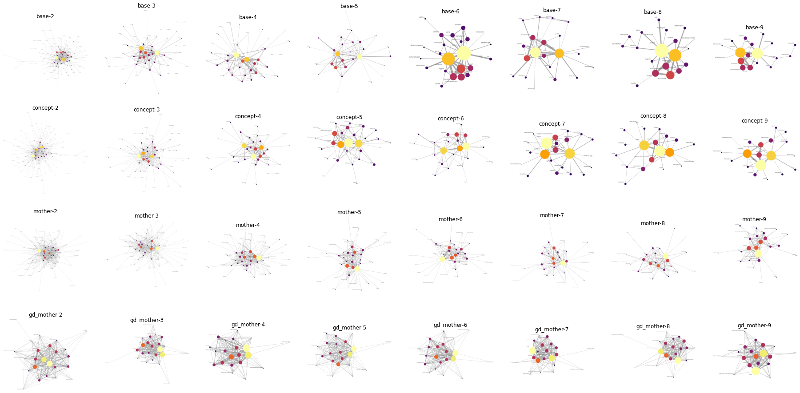
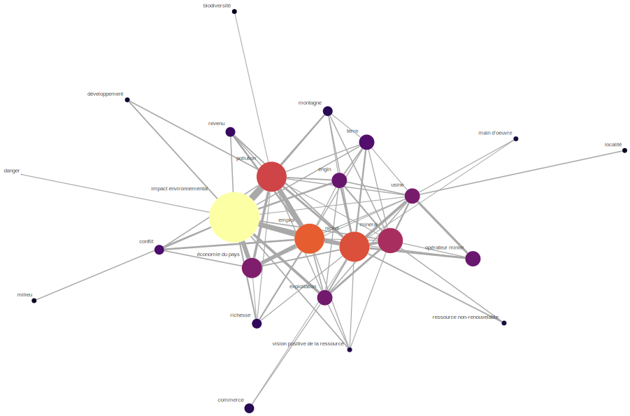
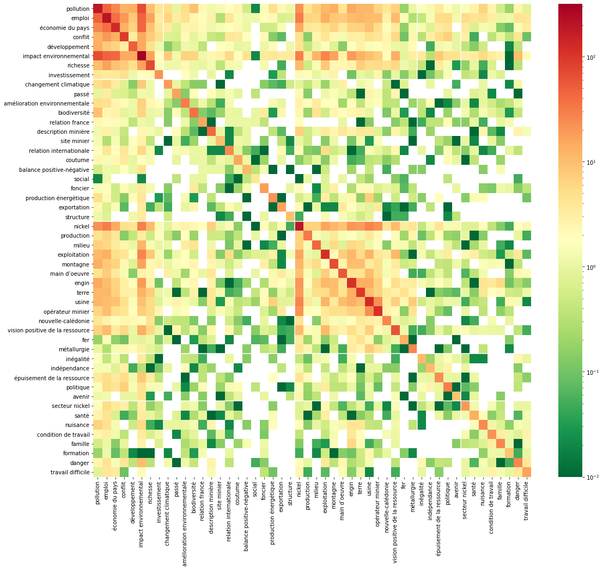

# Calculs et visualisation de cartes cognitives

- pour l'outil de calcul voir [CARTES_COG.md](CARTES_COG.md)
- pour la démo de la réunion du 2021-09-22, voir [le IPython Notebook](https://nbviewer.jupyter.org/github/romulusFR/cnrt_cartes_cog/blob/main/demo_calcul_seminaire.ipynb)

## Génération de tous les graphes

Disponible via le navigateur [sur cette page](viz/gallerie.html).

## Visualisation du thésauraus avec Vega

- Pour les visualisations du thésauraus avec <https://vega.github.io/vega/> voir [cette page](viz/index.html).
- Pour la visualisation _edge bundling_ (voir sur [www.data-to-viz.com](https://www.data-to-viz.com/graph/edge_bundling.html)), voir [cette page ci](viz/bundling.html) (assez gourmant en ressources)

## Images extraites du IPython Notebook

### Gallerie des graphes

Généré sur les co-occurrences des cartes **la mine** où les mots sont remplacé par leurs mots-mères, pour des poids exponentiels inverse, avec des seuils de 2.0 à 9.0.

### Graphe

Pour les cartes **la mine** où les mots sont remplacé par leurs mots-mères, pour des poids exponentiels inverse, seuil à 9.0 co-occurrences. C'est le dernier graphe de la troisième ligne de la gallerie précédente

### Heatmap

Pour les cartes **la mine** où les mots sont remplacé par leurs mots-mères, pour des poids exponentiels inverse (pas de seuillage)

