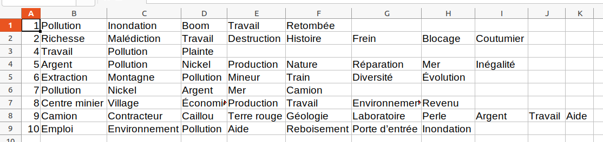
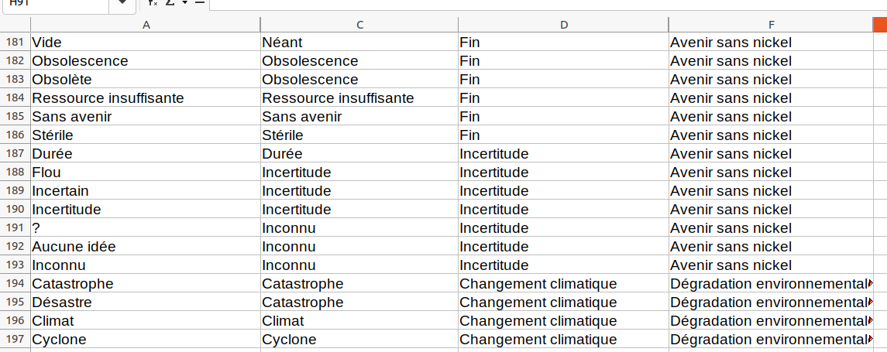
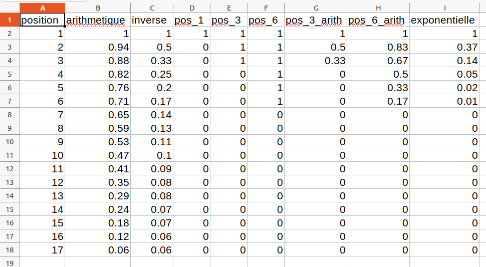
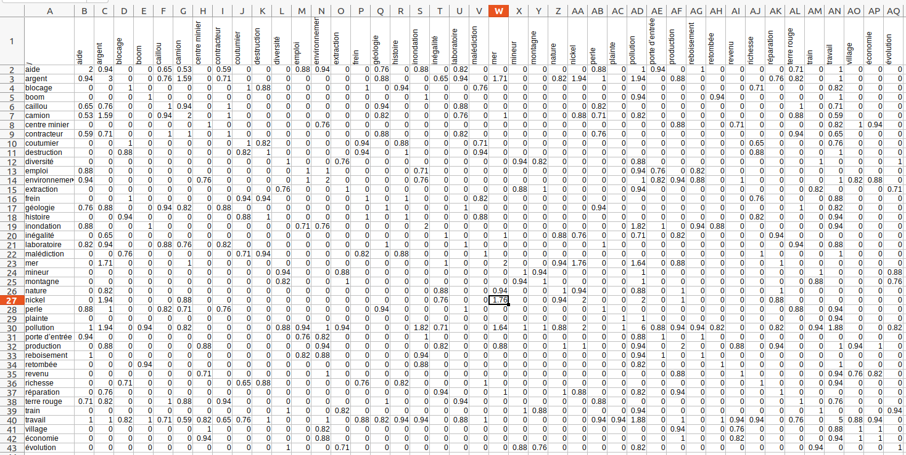
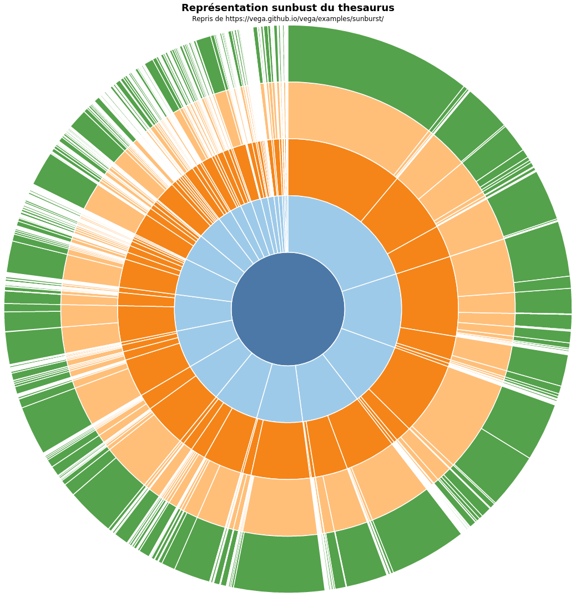
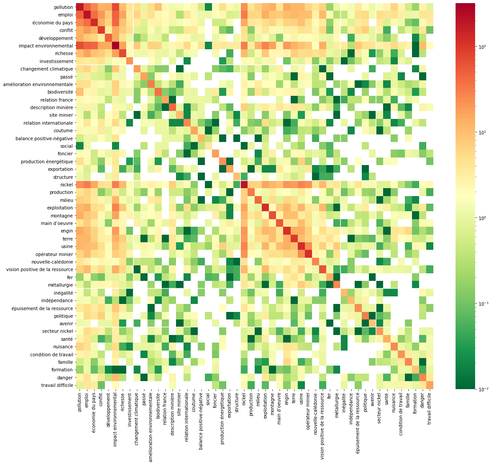
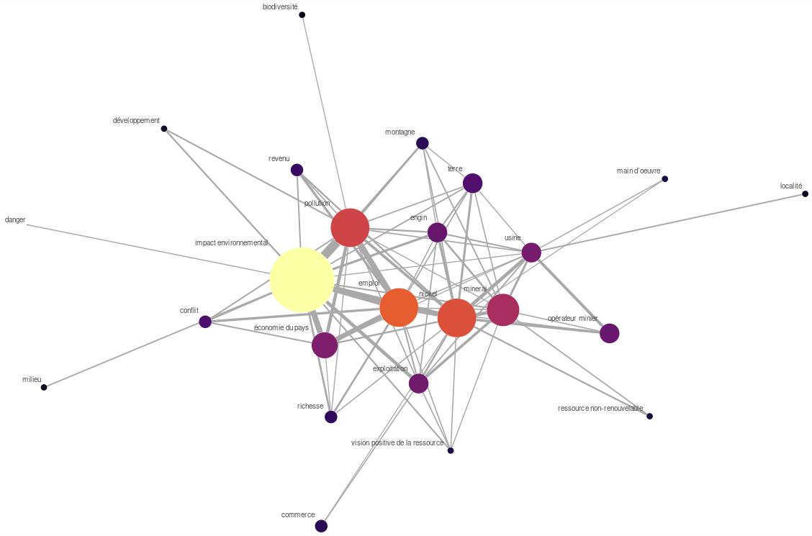
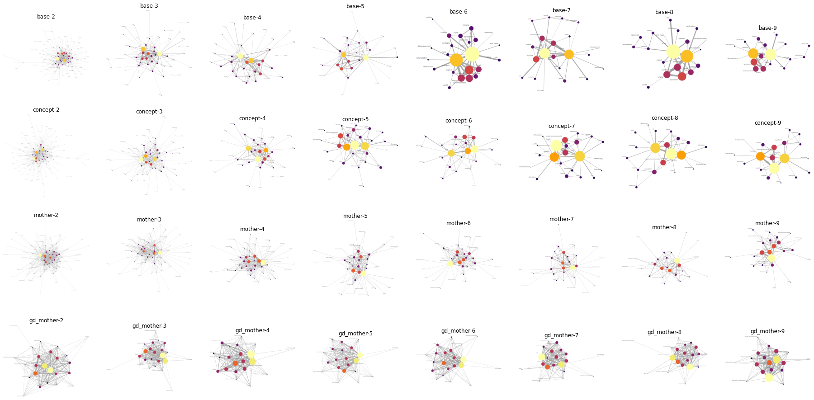
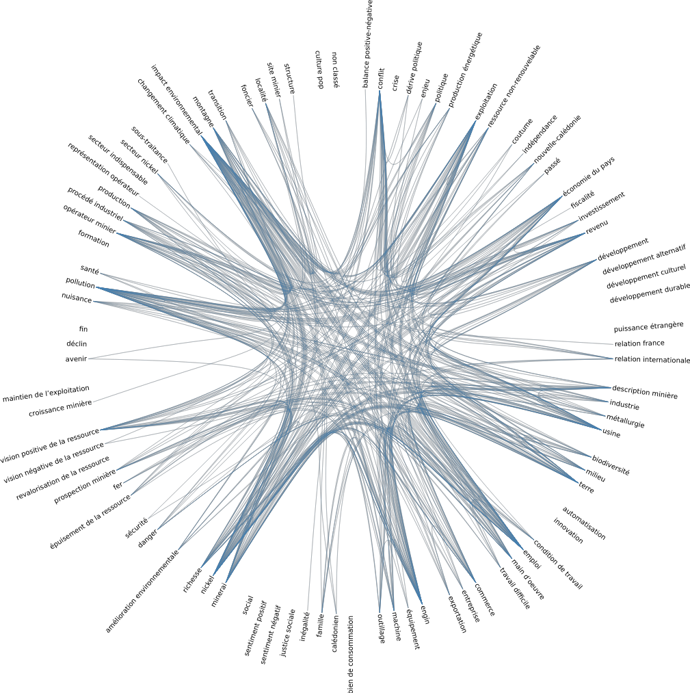

# Note sur le calcul de co-occurrences et la visualisation des cartes cognitives

Contributeurs :

- BOUDJEMA Valentine : doctorante sociologie IRD, experte fonctionnelle
- DUMAS Pascal : E/C géographie UNC, expert fonctionnel
- _MARTEL Benoit_ : stagiaire sociologie, IRD, expert fonctionnel
- SABINOT Catherine : chercheuse sociologie IRD, experte fonctionnelle
- **THION Romuald** : E/C informatique UNC, contributeur principal

## Objectifs

Les cartes cognitives sont des listes ordonnées de mots librement énoncés par des répondants lors d'enquêtes effectuées dans la tâche B.1.2 "Empreinte cognitive et représentations".
Dans le cadre du stage de BENOIT Martel, l'enquête a retenue les réponses de 404 répondants sur questions "la perception actuelle de la mine" et "la perception de la mine dans le futur".
La tâche a aussi produit _un thésaurus_, qui associe à chaque mot _énoncé_ un mot _concept_, à chaque mot _concept_ un mot _mère_ et à chaque mot _mère_ un mot _grand-mère_ muni le corpus d'une structure arborescente.

Par exemple, à la question "quelle est votre la perception actuelle de la mine", le répondant numéro 19 a répondu _dans cet ordre_, "économie", "destruction", "pollution", "évolution", "civilisation", "dépendance" et "santé".
Le mot énoncé "évolution" est attaché au mot concept éponyme "évolution", qui est regroupé sour le mot mère "développement" lui même associé au mot grand mère "alternative au développement".

Quelques indicateurs volumétriques :

- 2 jeux de données, dénommés par la suite _mine_ et _futur_, de 404 réponses chacun
  - 3154 mots énoncés pour les cartes _mine_ dont 687 différents
  - 2019 mots énoncés pour les cartes _futur_ dont 702 différents
- le thésaurus en 4 niveaux comporte au total 1107 mots énoncés, réduits à 825 mots concepts, eux-mêmes réduits à 95 mots mères, eux-mêmes finalement réduits à 24 mots grand-mères.

Les volumes sont suffisament importants pour que les tâches de calculs d'occurrences, de positions ou le remplacement des mots par ceux des niveaux supérieurs du thésaurus soient rentablement automatisées par des programmes, ses manipulations dans un tableur étant assez fastidieuse et sujettes à erreurs.
Au surplus, il est intéressant de pouvoir pondérer les mots par leur ordres d'apparition dans les énonciations, ce qui commence à être difficile à réaliser avec un tableur. Le premier objectif de cette action est donc utilitaire, il consiste en l'automatisation de ces traitements algorithmiquement simples.

Cette base logicielle de traitement des cartes cognitives permet ensuite de développer de nouvelles méthodes et constituent un nouvel objectif, plus scientifique. Nous nous sommes intéressés à deux aspects :

1. identifier et évaluer les représentations graphiques susceptibles de représenter les cartes et le thésaurus pour en faciliter l'analyse par lex experts;
2. calculer et représenter graphiquement les _co-occurences_ de mots, pour pouvoir analyser les mots qui apparaissent ensemble, en prenant en compte leur distance dans les énonciations.

L'intégralité du travail produit dans l'action est publiquement accessible à l'adresse <https://romulusfr.github.io/cnrt_cartes_cog/>

## Outils

- la forge de développement <https://github.com/romulusFR/cnrt_cartes_cog> sur un projet public, contenant le code et les cartes à l'exclusion de toute information concernant l'identité des enquêtés. Cet outil permet de partager le code, gérer ses différentes versions, gérer la documentation et les évolutions successives et également générer automatiquement des sites webs à partir des documents versionnés.
- l'écosystème libre du langage de programmation <https://www.python.org/> version 3.9 pour les transformations les plus complexes et la génération de tableaux de bords d'avancement de l'intégration des données. Sont notamment utilisés les bibliothèques <https://pandas.pydata.org/> (gestion de données tabulaires), <https://seaborn.pydata.org/> (visualisation graphique) et <https://networkx.org/> (gestion de graphes)
- l'écosytème de visualisation graphique <https://vega.github.io/vega/> qui permet de produire des représentations graphiques Web riches et intéractives.
- le logiciel <https://graphviz.org/> pour le dessin des graphes, avec notamment les algorithmes de placement en 2 dimensions à inspiré de la physique des ressorts.

## Méthodes

Nous avons réalisé un module et quelques outils afférents Python pour traiter les cartes cognitives. Ces outils prenent en entrée des cartes, un thésaurus et des pondérations toutes au format _Comma Separated Values_ (CSV) respectivement comme ci-après.

Les principales fonctionnalités du logiciel sont les suivantes, la description technique est donnée [en annexe](#formalisation).

- remplacer les mots _énoncés_ des cartes cognitives par ceux des niveaux supérieurs du thésaurus pour obtenir les cartes des mots _concepts_, _mères_ et _grands-mères_.
- pour chacun des 4 niveaux et pour chaque pondération, calculer le nombre d'occurence de chaque mot,
- pour chacun des 4 niveaux et pour chaque niveau, classe les mots selon leur nombre d'occurrences,
- représenter graphiquement les mots utilisés pour chaque niveau sous forme de `sunburst` (représentation radiale) et `treemap` (représentation rectangulaire)
- pour chacun des 4 niveaux, calculer la matrice de co-occurrence des mots, c'est-à- dire un tableau à deux dimensions qui indique pour chaque couple de mot, par exemple `pollution` et `nickel`, le nombre de fois où ces mots apparaissent ensemble dans les cartes. La pondération est utilisée ici sur la distance d'apparition des mots. Par exemple, si `pollution` et `nickel` sont cités l'un juste après l'autre leur contribution sera plus importante que s'ils sont séparés par un ou plusieurs mots.
- représenter les co-occurrences précédentes sous forme d'un graphe, sous la forme de `heatmap` (tableau 2D où les entrées sont colorée selon l'importance des co-occurences) et sous la forme de `edge bundles` (une représentation graphique qui permet de visualiser des données hiérarchiques sur un cercle munis d'arcs, voir ci-après).

Ces outils ont pour but _de fournir des représentation graphiques intuitives, permettant à l'expert d'analyzer le contenu des cartes_ et en faire émerger _des relations difficiles à percevoir dans la masses brute des données_. Au dela de la volumétrie, la difficulté d'appréhension est introduite par le type même des données, des séquences de mots qui demandent de considérer l'ordre des énonciations, et l'incorporation du thésaurus qui introduit une notion d'échelle.

Les co-occurences sont particulièrement difficiles à interpréter sans outillage, car elle produisent rapidement des tableaux comportant de nombreuses valeurs dont il faut extraire des indicateurs graphiques ou statistiques pour être intelligibles.
En reprenant l'exemple précédent de 10 cartes cognitives, 60 mots ont été énoncés dont 42 mots différents. Il ya a donc déjà pour cet exemple $(42*41)/2 = 861$ co-occurences possibles. Bien que la majorité soit nulle car les mots ne sont pas cité ensemble, le tableau est déjà difficile à appréhender. A titre illustratif, on le donne ci dessous ouvert par un tableur :

Le problème est indigeste si on traite la carte _mine_ qui comporte 687 mots différents et produit un tableau à deux dimensions de 235 641 cases.

## Résultats préliminaires

On illustre ici les résultats des méthodes précédentes avec quelques représentations du contenu des cartes. Ces visualisation sont publiquement accessibles à l'adresse <https://romulusfr.github.io/cnrt_cartes_cog/>. Une partie d'entre elles est interactive, l'utilisateur pouvant lui même régler certains paramètres et voir le résultat graphiquement en direct.

### Occurences des mots par niveau

Les deux représentations suivantes permettent d'apprécier les cartes selon les regroupements induits par le thésaurus.
La première est radiale, c'est l'angle qui est proportionnel au nombre d'occurence de chaque mot. Les disques concentriques représentants les quatre niveaux du thésuaurus, du plus général au plus précis : mots _grands-mères_ (disque l'intérieur), _mères_, _concepts_ et _énoncés_ (disque le plus à l'extérieur)

La représentation suivante suit la même idée mais c'est ici la surface de chaque rectangle qui suit le nombre d'occurences. On ne représente que le premier et le dernier niveau du thésaurus, l'imbrication des rectangles et la couleur représentent la relation de spécialisation du thésaurus.

### Co-occurences

Une première approche simple consiste à colorier la relation des co-occurrence selon une échelle de couleur, avec possiblement un seuillage (pour supprimer les lignes et colonnes dont toutes les valeurs sont en dessous d'un seuil) et changement d'échelle (logarithmique en l'espèce, vue la variété des ordres de grandeurs). On la présente ci-dessous, pour les cartes grand-mères. Les lignes et colonnes ont été réorganisées avec l'algorithme de clustering `KMeans++` pour mieu faire appraitre les blocs de mots qui sont cités ensembles (en couleurs chaudes) :

Une représentation alternative consiste à considérer chaque mot comme un noeud et à positionner des arcs entre les paires de noeuds, la longueur de l'arc étant représentative du nombre de co-occcurences entre sa source et sa cible. On obtient par exemple le graphe suivant pour les cartes _mine_ où les mots sont remplacé par leurs mots mères, pour des poids exponentiels inverse, dont on ne garder que les arcs avec plus de 9.0 co-occurrences.

On peut faire varier le seuillage et changer le niveau du thésaurus pour générer ainsi une gallerie de graphe comme suit :

La dernière représentation des co-occurences proposée est celle _du diagramme chordal_ [Wikipedia](<https://en.wikipedia.org/wiki/Chord_diagram_(information_visualization)>), ici plus précisement celle du _hierarchical edge bundling_. Ici, les mots énoncés sont représentés sur un cercle et un arc relie les mots selon leur co-occurence. Les mots sont placés sur le cercle de sorte à minimiser les croisement d'arcs. De plus, les arcs sont courbés selon le plus proche niveau commun du thésuraus que les mots joints par les arcs partagent.

## Poursuite des travaux

TBD

## Annexe

### Formalisation

Soit $M$ l'ensemble infini des chaînes de caractères de longueurs finies appellée _mots_.
Une _carte_ $c$ de longueur $l$ est une séquence finie de mots $c = [ m_{1}, m_{2}, \dots, m_{l} ]$. On abuse de la notation en écrivant $m \in c$ pour indiquer qu'un mot $m \in M$ apparait dans une carte $c$, en écrivant $|c| = l$ pour désigner la longueur et en écrivant $c(i) = m_i$ pour le ième mot quand il existe.
Une collection $C$ de $n$ cartes est un ensemble fini de cartes $C = \{ c_1, c_2, \dots,  c_n \}$. Sur le cas d'espèce on dispose donc de deux collections $C_{\text{mine}}$ et $C_{\text{futur}}$ chacune de cardinalité 404, $|C_{\text{mine}}| = |C_{\text{futur}}| = 404$.

Le thésaurus $T$ est représenté par trois applications partielles $T = (T_c, T_m, T_g)$ toutes de type $M \to M$. $T_c$ (resp., $T_m$, $T_g$) est l'application qui aux mots énoncés fait correspondre les mots concepts (resp. aux mots concepts les mots mères et aux mots mères les mots grands-mères). Par la suite, on suppose que chacune de ses applications est bien définie là où on l'applique.

A partir d'une carte (énoncée) $e = [ m_{1}, m_{2}, \dots, m_{l} ]$, on peut définir sa carte concept $c$ obtenue en appliquant $T_c$ à chaque mot $c = T_c(e) = [ T_c(m_{1}), T_c(m_{2}), \dots, T_c(m_{l}) ]$. Ainsi, ont obtient une nouvelle carte où chaque mot énoncé a été rémplacé par son mot concept.
Similairement, on peut définir la carte mère $m$ comme $m = T_m(c) = (T_m \circ \ T_c)(c)$ et la carte grand mère $g = T_g(m) = (T_g \circ T_m \circ \ T_c)(c)$.

Un sytème de poids est une application $p : \mathbb{N} \to \mathbb{R}$ qui à chaque position (ou écart de position) donne un poids réel avec la contrainte que $p(0) = 1.0$ et que les poids sont décroissants $\forall i. p(i) \geq p(i+1)$.

Ces définitions sont facilement implémentables en Python et permettent de calculer des indicateurs sur les collections. Soit $C$ une collection de cartes :

- la longueur moyenne des cartes comme $\sum_{c \in C} |c| / |C|$
- le nombre d'occurence de chaque mot $m$ pondéré par la position $\text{occ}(m)$ comme $\text{occ}(m) = \sum_{c \in C} \{ p(i) \mid c(i) = m \}$. Notons que si le poid est la fonction qui renvoie 1.0 partout, alors on obtient simplement le nombre d'occurrences du mot $m$ dans la collection $C$.

On désigne par $\text{E}(C)$ l'ensemble des mots énoncés (sans répétition) d'une collection de cartes $C$, $\text{E}(C) = \{ m \in M \mid \exists c \in C \text{ t.q. } m \in c\}$. Sur le cas d'espèce, on a par exemple $|\text{E}(C_{\text{mine}})|=687$.
On définit le graphe simple, non-orienté et pondéré des co-occurences de mots. Ce graphe $G$ est assimilable à une relation une fonction de poids $w : \text{E}(C) \times \text{E}(C) \to \mathbb{R}^+$ construite comme la somme des distances entre les mots $s$ et $d$ où $s$ et $d$ apparaissent dans une carte :

$$ w(s,d) = \sum\_{c \in C} \{ p(|i-j|) \mid \exists i, j. c(i) = s \wedge c(j) = d \} $$

Pour les cartes énoncés, la diagonale de cette relation désigne le nombre de fois où un mot $m$ apparait en prenant en compte de la pondération $w(m, m) = \text{occ}(m)$. En revanche, si un même mot apparait plusieurs fois dans une cartes, ce qui est possible sur les cartes énoncés, cartes mères et cartes grands-mères, alors on a $w(m, m) \leq \text{occ}(m)$.
