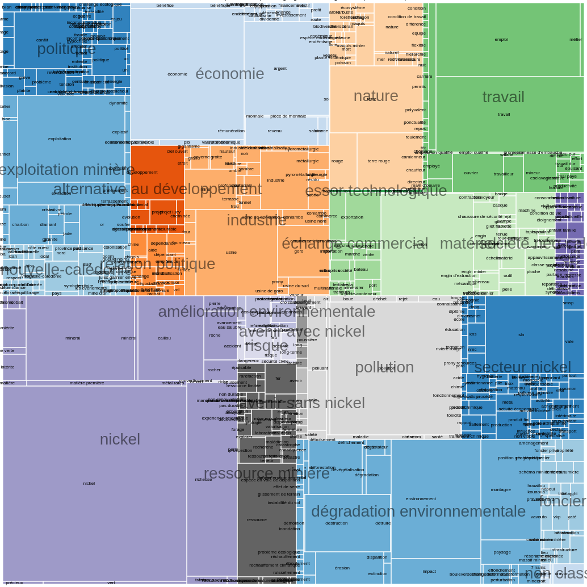

# Note sur le calcul de cooccurrences et la visualisation des cartes cognitives

Contributeurs :

- BOUDJEMA Valentine : doctorante géographie IRD, experte fonctionnelle
- DUMAS Pascal : E/C géographie UNC, expert fonctionnel
- _MARTEL Benoit_ : stagiaire anthropologue, IRD, expert fonctionnel
- SABINOT Catherine : chercheuse ethnoécologie et anthropologie IRD, experte fonctionnelle
- **THION Romuald** : E/C informatique UNC, contributeur principal

## Objectifs

Les cartes cognitives sont des listes ordonnées de mots librement énoncés par des répondants lors d'enquêtes effectuées dans la tâche B.1.2 "Empreinte cognitive et représentations". Les enquêtes ont permis de retenir 404 réponses à chacune des deux questions suivantes :

- "quelle est votre la perception actuelle de la mine",
- "quelle est votre la perception de la mine dans le futur".

La tâche a aussi produit _un thésaurus_, qui associe à chaque mot _énoncé_ un mot _concept_, à chaque mot _concept_ un mot _mère_ et à chaque mot _mère_ un mot _grand-mère_. Ce thésaurus muni ainsi le corpus d'une structure arborescente en quatre niveaux.

Par exemple, à la question "quelle est votre la perception actuelle de la mine", le répondant numéro 19 a répondu _dans cet ordre_ les sept mots "économie", "destruction", "pollution", "évolution", "civilisation", "dépendance" et "santé".
Dans le thésaurus, le mot énoncé "évolution" est associé au mot _concept_ éponyme "évolution", qui est associé au mot _mère_ "développement" lui-même associé au mot _grand-mère_ "alternative au développement".

Quelques indicateurs volumétriques :

- 2 jeux de données, dénommés par la suite _mine_ et _futur_, de 404 réponses chacun :
  - 3154 mots énoncés pour les cartes _mine_, dont mots 687 différents
  - 2019 mots énoncés pour les cartes _futur_, dont mots 702 différents
- le thésaurus en quatre niveaux comporte au total :
  - 1107 mots énoncés,
  - réduits à 825 mots concepts,
  - eux-mêmes réduits à 95 mots mères,
  - eux-mêmes finalement réduits à 24 mots grands-mères.

Les volumes sont suffisamment importants pour que les calculs d'occurrences, de positions ou le remplacement des mots par ceux des niveaux supérieurs du thésaurus soient automatisées par des programmes, ces manipulations dans un tableur étant assez fastidieuses et sujettes à erreurs.
Au surplus, il est intéressant de pouvoir pondérer les mots par leurs ordres d'apparition dans les énonciations, ce qui commence à être difficile à réaliser avec un tableur.
Le premier objectif de cette action est donc utilitaire, il consiste en l'automatisation de ces traitements algorithmiquement simples.

Cette base logicielle de traitement des cartes cognitives permet ensuite de développer de nouvelles méthodes et constituent un nouvel objectif, plus scientifique. Nous nous sommes intéressés à deux aspects :

1. identifier et évaluer les représentations graphiques susceptibles de représenter les cartes et le thésaurus pour en faciliter l'analyse par les experts;
2. calculer et représenter graphiquement les _cooccurrences_ de mots, pour pouvoir analyser les mots qui apparaissent ensemble, en prenant en compte leur distance dans les énonciations.

L'intégralité du travail produit dans l'action est publiquement accessible à l'adresse <https://romulusfr.github.io/cnrt_cartes_cog/>

## Outils

- le projet public <https://github.com/romulusFR/cnrt_cartes_cog> sur la forge de développement GitHub contient le code et les cartes à l'exclusion de toute information concernant l'identité des enquêtés. Cet outil permet de partager le code, gérer ses différentes versions, gérer la documentation et les évolutions successives et également de générer automatiquement des pages Web à partir des documents versionnés.
- l'écosystème libre du langage de programmation <https://www.python.org/> version 3.9 pour tous les calculs sur les cartes. Sont notamment utilisés les bibliothèques <https://pandas.pydata.org/> (gestion de données tabulaires), <https://seaborn.pydata.org/> (visualisation graphique) et <https://networkx.org/> (gestion de graphes)
- l'écosystème de visualisation graphique <https://vega.github.io/vega/> qui permet de produire des représentations graphiques Web riches et interactives.
- le logiciel <https://graphviz.org/> pour le dessin des graphes, avec notamment les algorithmes de placement en deux dimensions inspirés de la mécanique des ressorts.

## Méthodes

Nous avons réalisé un module et quelques outils afférents Python pour traiter les cartes cognitives. Ces outils prennent en entrée des cartes cognitives, un thésaurus et des pondérations toutes au format _Comma Separated Values_ (CSV) respectivement comme ci-après. Les pondérations associent à chaque position un coefficient entre 0.0 et 1.0, ce qui permet de prendre en compte l'ordre d'énonciation dans le compte d'occurrences.

Les principales fonctionnalités du logiciel sont les suivantes, la description formelle est donnée [en annexe](#formalisation).

- remplacer les mots _énoncés_ des cartes cognitives par ceux des niveaux supérieurs du thésaurus pour obtenir les cartes des mots _concepts_, _mères_ et _grands-mères_.
- pour chacun des 4 niveaux et pour chaque pondération, calculer le nombre d'occurrences de chaque mot,
- pour chacun des 4 niveaux et pour chaque position, classer les mots selon leur nombre d'occurrences,
- représenter graphiquement les mots utilisés pour chaque niveau sous forme de `sunburst` (représentation radiale) et `treemap` (représentation rectangulaire),
- pour chacun des 4 niveaux, calculer la matrice de cooccurrences des mots, c'est-à-dire un tableau à deux dimensions qui indique pour chaque couple de mot, par exemple `pollution` et `nickel`, le nombre de fois où ces mots apparaissent ensemble dans les cartes. La pondération est utilisée ici sur la distance d'apparition des mots. Par exemple, si `pollution` et `nickel` sont cités l'un juste après l'autre leur contribution sera plus importante que s'ils sont séparés par un ou plusieurs mots.
- représenter les cooccurrences précédentes sous forme d'un graphe, sous la forme de `heatmap` (tableau 2D où les entrées sont colorées selon l'importance des cooccurrences) et sous la forme de `edge bundles` (une représentation graphique qui permet de visualiser des données hiérarchiques sur un cercle munis d'arcs, voir ci-après).

Ces outils ont pour but _de fournir des représentations graphiques intuitives, permettant à l'expert d'analyser le contenu des cartes_ et d'en faire émerger _des relations difficiles à percevoir dans la masse brute des données_.
Au-delà de la volumétrie, la difficulté d'appréhension est introduite par le type même des données, des séquences de mots qui demandent de considérer l'ordre des énonciations et l'incorporation du thésaurus qui introduit une notion d'échelle.

Les cooccurrences sont particulièrement difficiles à interpréter sans outillage, car elles produisent rapidement des tableaux comportant de nombreuses valeurs dont il faut extraire des indicateurs graphiques ou statistiques pour être intelligibles.
En reprenant l'exemple précédent de 10 cartes cognitives, 60 mots ont été énoncés dont 42 mots différents.
Il ya a donc déjà pour cet exemple $(42*41)/2 = 861$ cooccurrences possibles. Bien que la majorité soit nulle car les mots ne sont pas cités ensemble, le tableau est déjà difficile à appréhender. A titre illustratif, on le donne ci-après.

Le problème est indigeste si on traite la carte _mine_ qui comporte 687 mots différents et produit un tableau à deux dimensions de 235 641 cases.

## Résultats préliminaires

On illustre ici les résultats des méthodes précédentes avec quelques représentations du contenu des cartes. Ces visualisations sont publiquement accessibles à l'adresse <https://romulusfr.github.io/cnrt_cartes_cog/>.
Une partie d'entre elles est interactive, l'utilisateur pouvant lui-même régler certains paramètres et voir le résultat graphiquement en direct.

### Occurrences des mots par niveau

Les deux représentations suivantes permettent d'apprécier les cartes selon les regroupements induits par le thésaurus.
La première représentation est radiale, c'est l'angle qui est proportionnel au nombre d'occurrences de chaque mot.
Les disques concentriques représentants les quatre niveaux du thésaurus, du plus général au plus précis : mots _grands-mères_ (disque l'intérieur), _mères_, _concepts_ et _énoncés_ (disque le plus à l'extérieur)

La représentation suivante suit la même idée mais c'est ici la surface de chaque rectangle qui est proportionnelle au nombre d'occurrences. On ne représente que le premier et le dernier niveau du thésaurus, l'imbrication des rectangles et la couleur représentant la relation de spécialisation/généralisation du thésaurus.

### Cooccurrences

Une première approche simple consiste à colorier la relation des cooccurrences selon une échelle de couleur, avec possiblement un seuillage (pour supprimer les lignes et colonnes dont toutes les valeurs sont en dessous d'un seuil) et un changement d'échelle (logarithmique en l'espèce, vue la variété des ordres de grandeurs).
On représente cette _heatmap_ ci-dessous, pour les cartes grand-mères. Les lignes et colonnes ont été réorganisées avec l'algorithme de clustering `KMeans++` pour faire apparaître les blocs de mots qui sont cités ensembles (en couleurs chaudes).

Une représentation alternative consiste à considérer chaque mot comme un noeud et à positionner des arcs entre les paires de noeuds, la longueur de l'arc étant représentative du nombre de cooccurrences entre la source et la cible de l'arc : plus les mots sont cités ensembles, plus ils sont proches dans le graphe.
On obtient par exemple le graphe suivant pour les cartes _mine_ où les mots sont remplacés par leurs mots mères, pour des poids suivant une loi exponentielle inverse dont on ne garde que les arcs avec plus de 9 cooccurrences.

On peut faire varier le seuillage et changer le niveau du thésaurus pour générer ainsi une galerie de graphes comme ci-après, ce qui permet à l'utilisateur de sélectionner les niveaux les plus pertinents pour son analyse.

La dernière représentation des cooccurrences proposée est celle _du diagramme chordal_ [Wikipedia](<https://en.wikipedia.org/wiki/Chord_diagram_(information_visualization)>), ici plus précisément celle du _hierarchical edge bundling_.
Dans cette représentation, les mots énoncés sont placés sur un cercle et un arc relie les mots selon leurs cooccurrences.
Les mots sont placés sur le cercle de sorte à minimiser les croisements d'arcs.
De plus, les arcs sont courbés selon le plus proche niveau commun du thésaurus que les mots joints par les arcs partagent.

## Poursuite des travaux

Cette action a porté sur le traitement informatique des cartes cognitives et du thésaurus pour automatiser des calculs et les représenter graphiquement.
La notion de cooccurrence a été introduite pour permettre d'étudier les groupements de mots cités ensembles.
Nous identifions deux axes majeurs de poursuite de cette action :

- l'analyse par les experts des indicateurs et visualisations déjà produites pour comprendre les représentations de la mine : il s'agit donc d'un prolongement de l'action informatique avec l'anthropologie pour faire émerger une connaissance nouvelle, basée et quantifiée sur les cartes existantes. Ceci pourra mener à la définition de nouvelles visualisations _ad hoc_ pour les cartes cognitives,
- la prise en compte des profils des répondants : l'action décrite jusqu'ici a traité les cartes "pures", c'est-à-dire essentiellement comme des objets mathématiques sans prendre en compte les profils des enquêtés qui les ont énoncées, comme leur âge ou leur CSP. L'introduction de ces nouvelles dimensions d'analyses enrichi d'autant plus les objets et rend le problème de leur visualisation plus ambitieux encore, typiquement si on introduit une segmentation sur les profils des enquêtés. Nous envisageons de compléter les outils actuels avec des méthodes statistiques comme l'analyse des correspondances et ses variantes pour relever le défi de la visualisation.

## Annexe

### Formalisation

Soit $M$ l'ensemble infini des chaînes de caractères de longueurs finies appelée _mots_.
Une _carte_ $c$ de longueur $l$ est une séquence finie de mots $c = [ m_{1}, m_{2}, \dots, m_{l} ]$. On abuse de la notation en écrivant $m \in c$ pour indiquer qu'un mot $m \in M$ apparaît dans une carte $c$, en écrivant $|c| = l$ pour désigner la longueur et en écrivant $c(i) = m_i$ pour le ième mot quand il existe.
Une collection $C$ de $n$ cartes est un ensemble fini de cartes $C = \{ c_1, c_2, \dots,  c_n \}$. Sur le cas d'espèce on dispose donc de deux collections $C_{\text{mine}}$ et $C_{\text{futur}}$ chacune de cardinalité 404, $|C_{\text{mine}}| = |C_{\text{futur}}| = 404$.

Le thésaurus $T$ est représenté par trois applications partielles $T = (T_c, T_m, T_g)$ toutes de type $M \to M$. $T_c$ (resp., $T_m$, $T_g$) est l'application qui aux mots énoncés fait correspondre les mots concepts (resp. aux mots concepts les mots mères et aux mots mères les mots grands-mères). Par la suite, on suppose que chacune de ses applications est bien définie là où on l'applique.

A partir d'une carte (énoncée) $e = [ m_{1}, m_{2}, \dots, m_{l} ]$, on peut définir sa carte concept $c$ obtenue en appliquant $T_c$ à chaque mot $c = T_c(e) = [ T_c(m_{1}), T_c(m_{2}), \dots, T_c(m_{l}) ]$. Ainsi, ont obtient une nouvelle carte où chaque mot énoncé a été remplacé par son mot concept.
Similairement, on peut définir la carte mère $m$ comme $m = T_m(c) = (T_m \circ \ T_c)(c)$ et la carte grand mère $g = T_g(m) = (T_g \circ T_m \circ \ T_c)(c)$.

Un système de poids est une application $p : \mathbb{N} \to [0.0, \dots, 1.0]$ qui à chaque position (ou écart de position) donne un poids réel avec la contrainte que $p(0) = 1.0$ et que les poids sont décroissants $\forall i. p(i) \geq p(i+1)$.

Ces définitions sont facilement implémentables en Python et permettent de calculer des indicateurs sur les collections. Soit $C$ une collection de cartes :

- la longueur moyenne des cartes comme $\sum_{c \in C} |c| / |C|$
- le nombre d'occurrences de chaque mot $m$ pondéré par la position $\text{occ}(m)$ comme $\text{occ}(m) = \sum_{c \in C} \{ p(i) \mid c(i) = m \}$. Notons que si le poid est la fonction qui renvoie 1.0 partout, alors on obtient simplement le nombre d'occurrences du mot $m$ dans la collection $C$.

On désigne par $\text{E}(C)$ l'ensemble des mots énoncés (sans répétition) d'une collection de cartes $C$, $\text{E}(C) = \{ m \in M \mid \exists c \in C \text{ t.q. } m \in c\}$. Sur le cas d'espèce, on a par exemple $|\text{E}(C_{\text{mine}})|=687$.

On définit le graphe simple, non-orienté et pondéré des cooccurrences de mots. Ce graphe $G$ est assimilable à une relation une fonction de poids $w : \text{E}(C) \times \text{E}(C) \to \mathbb{R}^+$ construite comme la somme des distances entre les mots $s$ et $d$ où $s$ et $d$ apparaissent dans une carte :

$$ w(s,d) = \sum_{c \in C} \{ p(|i-j|) \mid \exists i, j. c(i) = s \wedge c(j) = d \} $$

Comme il est clair que l'application $w$ est symétrique $\forall s, d. w(s, d) = w(d, s)$, le graphe est symétrique. De plus, la diagonale domine, au sens où $\forall s, d. w(s,d) \leq w(s,s)$.
